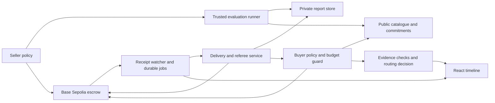

# Black Box Bazaar: research and implementation plan

Build **EvalVault**, a marketplace where evaluator agents sell private, task-specific model evaluation reports to buyer agents choosing how to run an application. Start with structured customer-support ticket routing: given a ticket, select the correct tool and produce valid, correct JSON arguments. The buyer purchases evidence, checks it, and uses it to choose an endpoint or abstain.

The recommended implementation is **Base Sepolia + one Solidity escrow contract + TypeScript agents + a React interface + one persistent Node service**. Keep reports private, make payment and settlement observable on-chain, and disclose the trusted evaluation and delivery operator. Optimize the interval from a purchase decision to usable evidence; prepare expensive evaluations before the purchase.

This is a design proposal, not an implemented or benchmarked system. Vertical rankings, time estimates, scope choices, and performance targets are engineering judgments. Primary sources support the underlying workflows and technical constraints. There is no evidence yet of willingness to pay for this particular marketplace.

## 1. Requirements and success criteria

The assignment asks for agents trading information that the buyer cannot inspect before paying; a specific vertical with credible participants, evidence, incentives, and failure modes; and an actual public-testnet interaction. It explicitly emphasizes product judgment, the mechanism, usefulness, and the finished experience. Deliverables are a public repository with a short README, a video no longer than five minutes, a contract address and explorer link, and ideally a publicly accessible application.[^1]

The document says September 11 at 2 pm, without specifying a timezone or year in that deadline line. The current planning context is September 11, 2026, America/Los_Angeles. Confirm the deadline timezone before scheduling the final upload. The implementation budget is provisionally 4–6 focused hours, with a smaller fallback. The brief's 1–2-hour passing estimate should not be mistaken for a reliable estimate for every feature in this plan.

| Requirement | Concrete implementation | Evidence to show |
|---|---|---|
| Autonomous sellers | Seller policy requests an evaluation, packages it, prices it, and publishes a listing | Agent event log and seller-signed listing transaction |
| Autonomous buyers | Buyer filters, chooses, pays, verifies, and changes its routing decision under a budget | A complete run without manually selecting every purchase |
| Hidden information | Scores, outputs, failure examples, and decisive results remain private until payment | Unpaid API denial and a paid reveal |
| Specific vertical | Task schema, scoring version, sample counts, model configuration, freshness, latency conditions | A report that answers a concrete deployment question |
| Credibility | Runner attestation plus observable delivery/adjudication history | Explain exactly what the attestation means |
| Buyer protection | Escrow, defined failure predicates, arbitration, and timeout recovery | Successful purchase and actual refund |
| Reputation | Separate verified delivery outcomes, disputes, timeouts, and purchase counts | No invented universal trust score |
| Public testnet | Real deployment, listings, purchases, settlement, withdrawal | Address, chain ID, receipts, and explorer links |
| Finished experience | Goal, catalogue, live purchase timeline, evidence, and decision in one coherent screen | Self-explanatory demo and README |

**Completion means a buyer actually pays, obtains previously hidden evidence, uses it, and can recover funds under a demonstrated failure condition.** A deployment transaction alone is insufficient proof of the intended experience.

## 2. Vertical selection

The comparison prioritizes useful hidden information, practical verification, a meaningful agent action after purchase, implementation speed, data access, and a convincing short demo. These are relative judgments for this assignment, not market-size rankings.

| Vertical | Participants and paid asset | Verifiable part | Main weakness | Recommendation |
|---|---|---|---|---|
| **Task-specific model evaluations** | Evaluation labs sell fresh, private test outcomes to application/router agents | Recompute objective grades; check scope, provenance claims, configuration, and observation conditions | Provider execution and future performance need additional trust | **First choice**: useful purchase-to-decision loop |
| **Governance execution impact** | Analysts sell treasury/delegate agents decoded actions and exposure dossiers | Pinned sources, arithmetic, calldata, simulated state effects | Simulation and proposal semantics add integration work | **Second choice** if domain familiarity or data access favors it |
| **Defensive dependency intelligence** | Maintainer agents buy environment-specific remediation evidence | Package/version matches, advisory references, fixed versions | Matching does not establish reachability or actual compromise | Strong bounded alternative |
| **Scientific reproducibility** | Research agents buy independent reruns and discrepancy reports | Input/environment identity and output reproduction | Recreating environments can consume the entire budget | Use only with a tiny prepared experiment |
| **Sports scouting** | Recruitment agents buy role-specific reports and event evidence | Feature calculations and source events | Player fit is subjective and outcomes arrive later | Less suitable for rapid objective disputes |
| **Endpoint observations** | Routing agents buy fresh latency/error observations | Recalculate sample statistics and resample | Thin differentiation and observer-location trust | Fastest narrow fallback within the evaluation theme |

The supporting evidence is domain-specific. HELM argues for controlled, multi-metric evaluation across scenarios; its existence also means public leaderboard scores are already available and are weak paid products.[^2] MLPerf Endpoints evaluates serving behavior under explicit concurrency and workload conditions, supporting a buyer-specific quality/speed/cost dossier.[^3]

Tally already simulates executable governance proposals, so governance analysis should add treasury-specific consequences or detect a discrepancy rather than merely summarize proposal text.[^4] OSV exposes version/commit vulnerability queries; FIRST explains that EPSS excludes organization-specific context. Together, they identify an enrichment opportunity while setting limits on what public scores establish.[^5][^6]

ENCORE describes practical reproducibility problems in computational research.[^7] StatsBomb provides football events and related data, but those public inputs alone do not establish the quality of a scouting recommendation.[^8] RIPE Atlas exposes measurement statistics; raw ping results would similarly need meaningful application-level or location-specific enrichment to become a useful paid asset.[^9]

**Selection rule:** choose evaluations unless model access and a real small evaluation cannot be established quickly. If hosted model access fails, evaluate two small local routing models or configurations and label them accurately. Switch to governance only if a useful pinned proposal and an execution-impact workflow are already easier to obtain. Avoid changing verticals after the contract and evidence schema are integrated.

## 3. The product and the information being sold

The initial customer is an application operator deciding which model configuration can route support tickets correctly within a latency and cost budget. Seller agents represent evaluators that incur the cost of running a task suite. Buyer agents represent those operators. The marketplace operator supplies a trusted runner, private storage/delivery, and a deterministic referee.

The paid asset is a **new workload-specific evaluation dossier**, including unfavorable results. It is not a promise that a model is good. An accurate report showing that a candidate performs poorly is still a valid product. The buyer pays for reducing uncertainty and avoiding duplicated evaluation work; the existence and strength of that demand remain hypotheses to validate.

Use 20–40 synthetic, labeled tickets and two accessible candidate configurations. Score exact tool choice, required JSON schema, and field correctness. Include ambiguous or unsupported requests for which escalation is the expected answer. Do not execute arbitrary seller-provided code or give the evaluated model production support tools.

Publish the scoring code and illustrative tests. Generate the actual traded run privately. Commit the suite identifier and run configuration before executing the candidates, record all attempts, and do not let a seller silently discard failed runs. A private dataset commitment helps audit consistency; it does not prove unbiased test construction. The operator remains trusted to construct and run the suite honestly.

| Public before purchase | Private until paid |
|---|---|
| Task family, output schema, evaluation-method version | Per-case inputs, expected outputs, actual outputs |
| Candidate model/configuration identifiers | Scores, error patterns, failure examples |
| Case count and observation window | Measured latency distribution and raw samples |
| Region, concurrency, retry policy, provenance tier | Detailed usage and cost calculation |
| Price, seller identity/history, refund criteria | Buyer-specific recommendation derived from evidence |
| Salted content commitment and runner signature | Payload salt and full signed run record |

Do not expose the decisive metric in a teaser, sort order, API response, HTML payload, chart, or hidden client-side property. A blurred report that has already been downloaded is not hidden. The public repository must not contain the live paid payload or its private generation seed. Public fixtures should be distinct, clearly synthetic protocol examples.

The evaluation record should preserve model identity, configuration, execution status, outputs, scoring version, sample count, and timing context. Inspect's log and scoring designs offer a useful reference for this evidence structure; using its full Python framework is optional for a small TypeScript prototype.[^10][^11] Reproducible evaluation research likewise motivates recording the complete setup instead of treating a model name as a complete experiment description.[^12]

## 4. Meaningful agent behavior

### Seller policy

Observe demand for a supported task suite, identify missing or expired coverage, request a runner job within an evaluation budget, then publish the resulting dossier. Price with a transparent configured policy, such as a nominal minimum plus a share of evaluation cost. Refresh only when evidence expires or a candidate configuration changes. Do not continuously rerun expensive evaluations merely because the UI is open.

For the core demo, two seller accounts can represent different evaluation strategies. They are simulated independent participants operated by one project owner; disclose this. The useful behavior is policy-driven evaluation, listing, pricing, and fulfillment, not a claim of real third-party market participation.

### Buyer policy

1. Read a goal: task family, candidate set, acceptable observation age, quality floor, latency ceiling, and spending limits.
2. Detect an evidence gap; skip reports already purchased or covering an incompatible suite.
3. Filter using public scope, freshness, allowed runner, price, seller history, and remaining budget.
4. Rank eligible reports using transparent policy. Hidden scores must never influence this pre-purchase choice.
5. Reserve budget and submit a purchase. Reconcile uncertain transactions before any retry.
6. Retrieve privately, verify the commitment, authenticate the runner, and recompute the agreed metrics.
7. In the fuller protocol, accept valid evidence or challenge a defined violation. Distinguish low model performance from a defective report. The minimum protocol has already settled before reveal, so buyer checks there diagnose problems without providing a post-settlement refund right.
8. Choose the least-cost candidate meeting the observed quality and latency constraints, or abstain if none qualifies.
9. Run one held-out demonstration ticket through the selected candidate and show the result.

The buyer should visibly reject at least one stale, incompatible, duplicate, or overpriced listing. It should also be able to buy nothing. A policy that always purchases the first card does not convincingly demonstrate useful autonomy.

Use a model once to turn natural-language goals into a constrained policy or to explain a decision if credentials are available. Validate the structured output in code. Discovery and explanation can use inference; signing, authorization, arithmetic, verification, and settlement should use deterministic code. The brief requires autonomous agents but does not explicitly mandate an LLM for every action.

The economic idea is expected avoided decision loss minus information price, verification expense, and payment fees. That is a conceptual value-of-information model, not a measured trading advantage. In the testnet demo, keep the test-ETH budget separate from any USD-denominated inference estimate. Do not pretend valueless test tokens demonstrate real unit economics.

## 5. Trust and verification

Keep four claims separate throughout the interface and README:

| Claim | Evidence | What remains unproven |
|---|---|---|
| Integrity | Delivered bytes and salt match the commitment | Whether the bytes contain truthful information |
| Provenance | A known runner signs the record it observed | Provider internals and runner honesty |
| Contractual validity | Fixed checker validates the advertised report fields and recomputes grades | General model capability or future behavior |
| Buyer utility | Buyer can act on the evidence and record the result | General willingness to pay or future savings |

**Recommended provenance:** the trusted runner makes the provider calls itself, captures the responses, and signs the resulting record. Arbitrary seller-uploaded logs are only seller assertions unless independently checked. A valid signature over fabricated observations is still fabricated evidence if the signer is dishonest.

The verifier can check schema, case count, model/configuration binding, suite identity, supplied outputs, grade calculations, and the advertised observation window. It cannot guarantee future latency or identical responses from a changing hosted model. Recomputing grades checks recorded outputs; rerunning inference measures a new experiment and should not require byte-for-byte equality.

Reject missing/duplicate cases, invalid signatures, wrong scope, manipulated aggregates, and mismatched commitments. Do not grant refunds merely because a truthful report reveals poor performance or changes the buyer's mind. This boundary prevents “read it and claim disappointment” from becoming the refund strategy.

For a small suite, report raw counts and sample size. Label latency percentiles exploratory. Do not infer production reliability, strong tail guarantees, or universal model superiority from 20–40 requests. Larger repeated runs and separate held-out tasks belong after the core submission.

## 6. Payment and delivery mechanisms

| Approach | Strength | Cost or unresolved issue | Use |
|---|---|---|---|
| Direct payment then API response | Very small implementation | Buyer bears withholding/invalid-content risk | Comparison baseline only |
| Buyer acceptance alone | Simple approval path | Buyer can learn the secret and withhold payment | Insufficient without adjudication |
| Escrow with a trusted verifier | Clear enforceable money flow and private objective checks | Operator trust and availability | **Recommended** |
| Encrypted content and public key reveal | Can bind payment to a reveal event | Public ciphertext plus key reveals the product to everyone; quality still unresolved | Avoid for this product |
| Optimistic review and private arbitration | Buyer can contest a delivery receipt | More states, deadlines, and availability assumptions | Add in the fuller version |
| TEE | Can attest a measured verifier environment | Hardware/provider trust and deployment complexity | Later research direction |
| ZK | Can prove a precisely encoded predicate over private inputs | Circuit/prover work; does not establish external truth or utility | Later, only for a useful narrow predicate |

Privacy-preserving FairSwap studies both fair exchange and confidential dispute handling; ordinary dispute evidence can leak parts of the traded good. It also distinguishes protocol privacy from a buyer later redistributing purchased information.[^13] EvalVault therefore keeps dispute evidence private to its referee and makes no technical claim that plaintext cannot be copied after purchase.

### Core protocol

The smallest credible version uses `FUNDED -> RELEASED | REFUNDED`, a trusted settlement account, authenticated delivery, and a permissionless timeout refund. Its exact sequence is **sealed funding receipt → private server validation → verifier settlement transaction → sealed `RELEASED` receipt → authenticated reveal**. A validation failure produces `REFUNDED` instead; a verifier that does not settle before the delivery deadline leaves the order eligible for a timeout refund. Normal settlement requires `timestamp < deadline`, and timeout requires `timestamp >= deadline`.

The receipt is an operator warranty that the conforming artifact is available, not cryptographic proof that the buyer read it. There is no buyer review window or post-settlement appeal in this smaller version. A delivery outage after release is an explicitly accepted operator risk. Waiting for release before revealing avoids a reveal-then-timeout race; it also means this minimal design needs two transaction inclusions before usable evidence.

### Fuller protocol

Freeze listing terms, artifact commitment, verifier/arbiter address, price, and timeout durations per order. New listings replace changed offers; existing purchases cannot be repriced or assigned different verification rules.

| State | Call and caller | Preconditions and result |
|---|---|---|
| Listing active | `buy(listingId, requestId)` by buyer | Correct chain and exact payment; unexpired listing; unused buyer request ID; create `FUNDED` order |
| `FUNDED` | `markDelivered(orderId, receiptHash)` by pinned verifier | Before delivery deadline; verifier warrants the specific private artifact is retrievable; enter `DELIVERED` and start review window |
| `FUNDED` | `reject(orderId, reasonCode)` by verifier | Before delivery deadline; credit full price to buyer; `REFUNDED` |
| `FUNDED` | `refundUndelivered(orderId)` by anyone | At/after delivery deadline; credit buyer; `REFUNDED` |
| `DELIVERED` | `accept(orderId)` by buyer | Before review deadline; credit seller; `RELEASED` |
| `DELIVERED` | `challenge(orderId, reasonCode, evidenceHash)` by buyer | Before review deadline; one challenge; `DISPUTED`; start resolution window |
| `DELIVERED` | `releaseAfterReview(orderId)` by anyone | At/after review deadline; credit seller; `RELEASED` |
| `DISPUTED` | `resolve(orderId, refund, decisionHash)` by pinned arbiter | Before resolution deadline; credit buyer or seller; terminal state |
| `DISPUTED` | `refundUnresolved(orderId)` by anyone | At/after resolution deadline; credit buyer; `REFUNDED` |
| Credit available | `withdraw()` by credited account | Zero credit before external transfer; reentrancy protection; record actual payout |

Start with direct verifier transactions rather than gasless signed adjudication. This reduces signature complexity. A relayed EIP-712 variant is optional; it must bind chain, contract, order, action/verdict, artifact/terms, and expiration, and reject replay. EIP-712 supplies typed signing and domain separation, not replay prevention by itself.[^14]

Use complementary deadline boundaries: valid normal actions require `timestamp < deadline`; timeout actions require `timestamp >= deadline`. Deadlines use chain time. A local countdown is a display convenience, not the authority. Once an order becomes terminal, every settlement/refund transition must fail.

Proposed demonstration durations are 120 seconds for delivery, 120 seconds for review, and 300 seconds for resolution. These are configurable testnet choices, not production recommendations. The happy path accepts immediately. Demonstrate a fast referee-resolved refund; test deadline boundaries locally without waiting through every window on video.

A buyer-friendly unresolved-dispute timeout exposes the seller to free consumption if the buyer has read the report and the referee then disappears. A seller-friendly default creates the opposite risk. State the selected tradeoff explicitly. The verifier and storage operator can also collude or leak data. Separating their keys does not create independent organizations.

Payment creates escrow funding before the reveal. Final seller payout can occur later. Explain this escrow interpretation of “pay before inspect” in the demo. Never say the seller has been paid merely because a purchase transaction funded escrow.

### Private delivery

Store the artifact durably before allowing purchases. For the minimum, use a private object encrypted at rest and serve it over HTTPS only after authenticating the purchasing wallet and checking the order. For the fuller version, use a separate recipient encryption key pair and a vetted sealed-box library. Ethereum signing keys are not automatically an encryption interface. Libsodium sealed boxes protect a message for a recipient but do not authenticate its sender; bind the envelope digest to the verifier's authenticated record.[^15]

Commit exact UTF-8 artifact bytes with a random 32-byte salt, for example `keccak256(abi.encode(schemaVersion, salt, artifactBytes))`. Persist those bytes instead of reconstructing JSON in a different key order. Disclose the salt privately with the report. Publish neither plaintext nor decryption keys in contract storage, calldata, events, repository fixtures, or public logs.

For the fuller protocol, stage the artifact or recipient envelope, persist its digest, and submit `markDelivered`. Serve the report after that transaction is observed in sealed L2 state. This defines “delivered” as a trusted availability warranty. A subsequent storage outage can require a buyer challenge; it is not atomic fair exchange. In the minimum protocol, reveal waits for sealed `RELEASED` and no subsequent challenge exists.

When recipient encryption is enabled, bind the buyer-authenticated recipient-key hash immutably to the order before preparing its envelope. Include order ID, key hash, artifact/terms commitment, and envelope digest in the verifier receipt. An authenticated retry must not replace the recipient key of an existing delivery receipt. Add the key-hash field to the frozen purchase schema for this version.

Retrieval authentication must bind the purchasing address to the order, service/domain, nonce, expiry, and any recipient key. Never trust a caller-supplied transaction hash alone. Verify chain ID, contract address, successful receipt, buyer, listing/order, and current entitlement. Permit retrieval only in `RELEASED` for the minimum protocol, or `DELIVERED`, `DISPUTED`, and `RELEASED` for the fuller protocol. Deny `FUNDED` and `REFUNDED`, rechecking before granting new access. Revocation cannot erase plaintext already downloaded.

Use private/no-store responses and enforce authorization on every retrieval. A short-lived URL is a bearer credential; do not log it or treat its obscurity as authorization. Freeze the report-retention period in the terms and keep the artifact available throughout review and adjudication. Judge advertised freshness against the agreed reference time, normally funding, rather than declaring fraud because delivery itself took time.

## 7. Incentives and reputation

Sellers earn for accurate, usable evidence of the specified kind; their report need not praise a model. Buyers gain timely information and defined recourse. The operator reduces bilateral delivery uncertainty but remains a trusted party. Use fixed nominal prices initially; auctions, bonding curves, and speculative tokens would distract from the information exchange.

Record completed deliveries, adjudicated report failures, unresolved timeouts, distinct buyer addresses, observation age, and volume. Keep technical report validity separate from buyer satisfaction and from whether an evaluated model passed its task. A storage outage should not automatically become evidence that a seller lied.

Cold-start sellers can rely on an allowed runner and limited prices. Display “new seller” honestly. Excluding same-address trades from reputation only stops the easiest manipulation; multiple wallets can still wash-trade. ERC-8004 itself discusses Sybil issues and limits on what agent registration can guarantee.[^16] Registry integration is optional interoperability work, not a requirement for the core.

Seller bonds are a later extension only if a clear objectively punishable violation and independent adjudication exist. In that extension, reserve collateral per open order so the same bond cannot back unlimited exposure. Bonds do not correct an unreliable referee or prove truthful data. Nonexclusive access is the default; exclusivity is not enforceable once a buyer learns the content.

## 8. Architecture and stack



| Layer | Recommendation | Reason and alternative |
|---|---|---|
| Chain | Base Sepolia, chain ID 84532, native test ETH | EVM compatibility and responsive interaction; use already-funded Arbitrum Sepolia if that removes setup risk |
| Contract | One non-upgradeable Solidity contract, pinned OpenZeppelin components | Small auditable state space; no token, NFT, bridge, or proxy needed |
| Contract tools | Foundry/Anvil if installed quickly | Focused unit/fuzz/state-machine tests; use a familiar JS toolchain if setup becomes a distraction |
| Shared types | TypeScript and strict JSON schemas | Common listing, evidence, order, and agent-policy interfaces |
| Chain client | viem | Typed clients, receipt decoding, and event handling |
| Interface | React/Vite | Appropriate for a client dashboard paired with a persistent worker; Next.js is fine if already familiar |
| Runtime | One persistent Node service | Hosts API, jobs, chain watcher, and agent orchestration without a distributed deployment |
| Storage | SQLite and private files on a persistent volume | Sufficient for one instance; hosted Postgres/object storage if deployment is stateless |
| Evaluation | Small deterministic scorer; direct provider calls or local candidate models | Avoid adding a large evaluation platform before the thin path works |

Base documents chain ID 84532, ETH, and standard Ethereum tooling.[^17] Arbitrum Nitro also supports the EVM and distinguishes fast sequencing from stronger confirmation; its advertised cadence is not a like-for-like end-to-end comparison.[^18] Ethereum Sepolia remains a supported application testnet alternative.[^19] Familiarity, funds, and working RPC access can matter more than nominal chain speed for a short assignment.

Foundry provides testing and deployment tools.[^20] OpenZeppelin offers reentrancy protection, but contract-specific authorization and accounting still need tests.[^21] Decode events from a transaction receipt instead of waiting for an explorer to index them; viem supports receipt retrieval and event parsing.[^22]

Use a persistent host capable of running the Node process and retaining the database. Select the actual provider during the deployment spike based on existing account access and runtime support. A static UI deployment alone cannot run custody, settlement, or autonomous jobs. For serverless hosting, change persistence and job execution explicitly; do not assume local files or an in-process watcher survive invocations. If choosing Next.js, keep sensitive modules server-only and authorize all action/API entry points.[^23]

The initial repository contains a README and editor settings, with no application scaffold. Node, pnpm, Docker, and GitHub CLI were found on PATH; Forge/Anvil/Cast were not found on PATH. This is a narrow readiness check, not a search of every installation path. Funding, provider credentials, Docker daemon status, and hosting access have not been verified.

## 9. Latency, efficiency, and measurement

Optimize three distinct things: development time, runtime response time, and evaluation cost. A more complicated chain protocol may save a little gas while adding hours of integration. Precomputing reports makes reveal fast but does not make the evaluation itself free; report both costs and both durations.

Base describes approximately 200 ms for Flashblock inclusion, 2 seconds for L2 block inclusion, 2 minutes for L1 batch inclusion, and 20 minutes for L1 batch finality.[^24] These are published chain-stage descriptions, not measured guarantees for this application's Base Sepolia transactions. The demo should release against a successful sealed L2 receipt and disclose the remaining sequencer/reorganization assumption. Preconfirmation can animate progress but should not authorize disclosure. An irreversible secret cannot be recovered if payment later reorganizes.

| Measurement | Initial engineering target | Qualification |
|---|---|---|
| Click to visible progress | p95 < 100 ms | Local UI acknowledgment |
| Warm catalogue response | p95 < 200 ms | Small indexed catalogue |
| Selection among at most 100 cached listings | p95 < 50 ms | Deterministic policy only |
| Purchase submission to sealed receipt | p95 < 5 seconds aspiration | External testnet/RPC conditions |
| Eligible sealed receipt to authorized report response | p95 < 500 ms | `RELEASED` in minimum; `markDelivered` in fuller; small artifact, warm service |
| Local integrity/schema/scoring check | p95 < 100 ms | Small JSON report, no inference |
| Minimum protocol: selection to usable evidence | p95 < 12 seconds aspiration | Includes funding and verifier-release transactions; excludes evaluation creation |
| Fuller protocol: selection to usable evidence | p95 < 12 seconds aspiration | Includes funding and delivery-receipt transactions |

All numbers above are proposed targets. They assume pre-funded agent accounts with unattended, policy-constrained signing; human browser-wallet approval time must be reported separately. Usable evidence includes local verification but excludes the subsequent held-out model call. Measure the full path directly; adding individual stage p95 values does not yield end-to-end p95. Acceptance, dispute resolution, and actual seller withdrawal have separate transaction latency. Track them explicitly rather than stopping the “complete experience” timer at reveal.

Excluding listing creation, the minimum successful flow has three transactions: funding, verifier release, and withdrawal. The fuller flow has four: funding, delivery receipt, buyer acceptance, and withdrawal. Both require two inclusions before reveal under the specified access policies. The fuller protocol adds review rights rather than promising faster delivery.

The optimization order is:

1. Generate and validate reports before they are purchased. Remove LLM calls from the funding-to-delivery path.
2. Use native test ETH to avoid an ERC-20 approval transaction. Count listing, funding, delivery receipt, acceptance, and withdrawal separately.
3. Reuse clients/connections, keep the worker near its storage, cache public catalogue metadata, and avoid explorer dependencies.
4. Read the purchase receipt directly and decode its order ID. Recheck sealed state before disclosure.
5. Use supported event subscriptions, with bounded polling and backfill. Start with measured 250–500 ms receipt polling only if RPC limits allow; back off on errors.
6. Bound concurrency. Parallelize independent read-only fetches and evaluation calls within a known budget; serialize signing per account.
7. Tune gas/storage only after correctness and the measured bottleneck are established.

Instrument monotonic timestamps for selection, signing, submission, receipt, delivery attestation submission/receipt, authorization, download, verification, acceptance, and withdrawal. Keep remote/provider timestamps as separate metadata. Do not subtract clocks from different machines without accounting for clock skew.

Report p50/p95, successful sample count, failures/timeouts, RPC calls per purchase, gas per method, payload size, concurrency, region, provider, chain, commit, and whether inference is included. Start with five warm-ups and 20–30 recorded testnet runs if funds/time permit; mark the tail estimate exploratory. Use local tests for larger fault campaigns. Never label local Anvil performance as public-testnet performance.

The report's model latency needs its own methodology: distinguish time to first token from full response time; record input/output sizes, concurrency, retries, cold/warm conditions, and provider errors. Never drop failures silently to improve the latency chart. MLPerf's workload/load framing supports these measurement distinctions; this miniature suite is not an MLPerf-compliant benchmark.[^3]

## 10. Interfaces, persistence, and recovery

Freeze the public interfaces before splitting implementation work. Keep the codebase small:

```text
contracts/       escrow, deployment script, contract tests
src/shared/     schemas, ABI export, chain configuration
src/server/     API, authentication, private storage, jobs, watcher
src/agents/     seller and buyer policies, execution budget guard
src/evals/      suite generator, provider adapters, deterministic scorer
src/web/        catalogue, goal controls, timeline, evidence and decision views
scripts/        setup, seed, demo, benchmark, verification
docs/           architecture, limitations, evidence and benchmark notes
```

Suggested API boundaries are `GET /listings`, `POST /agent-runs`, `GET /agent-runs/:id`, `GET /auth/challenge`, `POST /orders/:id/reveal`, and `POST /orders/:id/dispute-evidence`. Seller/evaluator endpoints are authenticated. A public demo control must not expose arbitrary signing or unrestricted report generation.

Persist listings, artifact metadata, runner records, orders, agent runs, execution jobs, transaction hashes/nonces, consumed authentication challenges, and a chain cursor. Use unique constraints for `(buyer, requestId)`, `(chainId, transactionHash, logIndex)`, and the relevant agent-run idempotency key. If preconfirmation events are ever stored, distinguish them from sealed events and include block identity for reorg handling.

Reserve budget transactionally before enqueueing a purchase. Recover transaction state after a process restart or RPC timeout. Store a signed transaction identity before broadcast when feasible; safely rebroadcast the same transaction or reconcile its nonce instead of creating a new economic action. Mark uncertain submissions as pending/unknown, not failed purchases eligible for immediate duplication.

Jobs should be small and idempotent: ingest receipt, authorize access, verify evidence, submit a state transition. BullMQ's documentation explains why retry-safe job design matters, but Redis/BullMQ is not required here.[^25] A persistent single-process job table is sufficient for the initial deployment.

Keep chain state authoritative for money and entitlement; use the database for indexing and workflow state. Backfill logs from the deployment block and resume from a stored cursor. Pause disclosure if RPC views conflict. A public read failure is not permission to trust a cached “paid” label indefinitely.

## 11. Threat model and validation

| Failure or attack | Intended behavior | Validation |
|---|---|---|
| Unpaid browser requests report | Deny without leaking content | API and browser-network test |
| A different wallet supplies a genuine purchase hash | Deny | Wrong-buyer integration test |
| Replayed auth challenge or changed recipient key | Deny | Nonce/domain/order/key-binding test |
| Payload swapped or truncated | Detect mismatch; referee refunds under agreed terms | Adversarial delivery fixture |
| Correctly committed malformed or mis-scored report | Reject objective violation | Scorer/schema tests and referee test |
| Valid report shows poor model results | Pay seller; buyer rejects candidate | Distinguish utility from report validity |
| Listing contains instructions to transfer extra money | Budget/contract policy rejects action | Malicious listing text test |
| Duplicate click/event/job | At most one intended payment and one terminal outcome | Replay/restart integration test |
| Worker crashes after broadcasting | Resume from known transaction identity | Restart during pending receipt |
| Verifier disappears | Timeout closes the order under published default | Local time-advance tests |
| Buyer challenges after reading without a valid defect | Referee applies fixed predicate | False-claim test |
| Recipient contract rejects ETH or reenters | Cannot double-withdraw or block unrelated users | Adversarial withdrawal contract |
| Reorg or RPC disagreement | No new disclosure until state reconciles | Mocked provider fault and cursor recovery |
| Seller/buyer collude to boost history | Do not claim Sybil resistance | UI disclosure and exclusion of obvious self-trades |

The contract should maintain liabilities no greater than its balance; each terminal order allocates its price exactly once; unauthorized callers cannot arbitrate; withdrawals cannot be repeated; and existing order terms never change. Use `balance >= liabilities`, not strict equality, because unexpected ETH can arrive. Fuzz deadline boundaries and interleavings of delivery, challenge, refund, and withdrawal. Foundry's invariant testing is designed to exercise randomized call sequences; ensure the test campaign actually reaches funded and terminal states rather than mostly reverting.[^26]

Keep signing keys, storage credentials, and provider secrets outside model prompts and browser bundles. Restrict chain, contract, selectors, destinations, value, spend total, and endpoint allowlists in code. External reports and tool outputs remain data; they must not modify the agent's authority. Anthropic's prompt-injection guidance supports separation of untrusted content and least-privilege tools.[^27]

For the hosted demo, prefer pre-funded dedicated test accounts with tiny capped balances and a fixed run policy. If visitors can trigger runs, impose global/per-session spend limits, concurrency limits, and rate limits. Do not make a private-key-bearing arbitrary transaction API. Test keys are still not public repository material.

## 12. Implementation orchestration

Use one integration owner and bounded parallel work after interface agreement. Parallelism helps only where tasks do not fight over files or depend on an unfinished schema.

| Owner | Bounded responsibility | Handoff |
|---|---|---|
| Integration owner | Schema/ABI freeze, environment and funding spike, integration, deployment, demo | Known chain/config and a working end-to-end command |
| Contract agent | Escrow, accounting, deadline/access tests, deployment script | ABI, events, invariant results, explicit state diagram |
| Evidence/service agent | Runner, private artifact format, delivery auth, deterministic checks | Versioned schemas and honest/adversarial fixtures |
| UI/agent-flow agent | Goal controls, policy behavior, catalogue, timeline, evidence and routing view | Screens consuming agreed API and event shapes |

The integration owner controls shared schemas, package manifests, and generated ABI updates. Each agent owns its files and reports assumptions, changed interfaces, and validation. Merge small working increments. At integration, reassign an available agent to challenge the trust claims and exercise recovery paths rather than adding another feature.

Dependency order is **funding/toolchain spike → frozen schemas and contract behavior → private evaluation artifact → real listing and purchase → authorized reveal and settlement → buyer decision → failure recovery → public deployment and submission evidence**. UI scaffolding and contract tests can run in parallel once interfaces are fixed; live reveal authorization depends on real contract behavior.

## 13. Timeboxes and stop rules

The 4–6-hour schedule is an aggressive target from an almost empty repository. It assumes working credentials, short setup, and effective parallel implementation. If those assumptions fail, reduce scope rather than compressing testing or misrepresenting a local-only result.

| Elapsed implementation time | Deliverable | Gate |
|---|---|---|
| 0–20 minutes | Confirm actual deadline; locate/install tools; fund dedicated accounts; probe RPC and hosting; exercise one provider/local candidate | A viable path to public-testnet deployment and real evidence |
| 20–60 minutes | Freeze schemas; implement minimal contract; prepare private report; build API/UI skeleton in parallel | Contract tests and a real artifact exist |
| 60–120 minutes | Real seller listing, buyer payment, authenticated reveal, objective check, settlement/withdrawal | Save public-testnet receipts immediately |
| Hours 2–3 | Buyer ranking/decline behavior, routing result, persistence, polished core screen | Autonomous loop survives refresh/restart |
| Hours 3–4 | Defined failure/refund demonstration; fuller dispute flow only if ahead | Core money/access tests pass |
| Hours 4–5 | Hosting, warm/cold measurements, latency timeline, README | Public app is usable from a fresh session |
| Final hour | Freeze features, rehearse, record under five minutes, verify links and deliverables | Submission package complete |

For a strict 1–2-hour fallback, use one seller, one real precomputed private report, one buyer policy with a rejection branch, the minimal verifier/timeout contract, and a simple visible receipt/report/decision flow. Disclose its centralized delivery and lack of post-settlement appeals. Keep on-chain settlement, hidden-before-payment behavior, and objective validation. Cut multi-seller breadth, live report generation, recipient-key encryption, optimistic disputes, analytics polish, and external protocol integrations.

For an 8+-hour extension, improve repeated measurements, held-out validation, crash recovery, independent verifier separation, and a second actual seller integration. This adds credibility before it adds protocol count. Only then consider x402 or agent registry interoperability.

Stop rules:

- If funding or model access is blocked after the initial spike, ask for the specific missing access while continuing local work; use the prepared fallback when appropriate.
- If no real on-chain purchase works by the two-hour checkpoint, pause UI expansion and finish the minimal contract-to-delivery path.
- If the fuller state machine threatens the deadline, retain the minimal verifier/refund design and describe its limits accurately.
- If time is short, record a working demo before attempting the next improvement.
- Freeze changes at least one hour before the actual submission deadline, with additional upload margin when practical.

## 14. Features beyond the baseline

| Priority | Feature | Why it earns its cost |
|---|---|---|
| 1 | Buyer action changes after the purchase | Proves information has a purpose |
| 2 | Real refund with a clear failure reason | Makes the protection mechanism falsifiable |
| 3 | Measured transaction/delivery timeline | Direct evidence for the latency objective |
| 4 | Refusal to buy stale, duplicate, or incompatible evidence | Makes autonomy credible |
| 5 | Repeatable demo and restart recovery | Reduces interview failure risk |
| 6 | One fresh evaluation and a held-out routing example | Shows the payload is actual evidence |
| 7 | Recipient-encrypted delivery and private dispute evidence | Strengthens confidentiality under the disclosed trust model |
| Later | x402 adapter, ERC-8004 registry, multiple independent referees | Useful interoperability only after the product works |

x402 offers a natural HTTP payment interface and currently documents a Base Sepolia seller flow.[^28] It adds token funding and facilitator integration, and it does not itself resolve report quality or the escrow policy. If added, define a separate payment route or a correct escrow-aware adapter; never charge through both paths for one purchase.

TEE and ZK should remain explicit roadmap items. AWS attestation documents how enclave measurements are represented; the research question is which verifier code and input provenance that attestation would actually protect.[^29] TRUCE studies private evaluation with trusted-computing and cryptographic approaches, supporting the relevance of confidentiality without demonstrating demand for this proposed market.[^30]

## 15. Demo and submission

Aim for roughly four minutes, leaving margin below the five-minute cap:

| Video time | Show |
|---|---|
| 0:00–0:25 | The concrete routing decision and why its evidence is hidden |
| 0:25–0:55 | Buyer goal, budget, candidates, seller metadata, and a declined listing |
| 0:55–1:40 | Autonomous purchase, real receipt, private reveal, and evidence checks |
| 1:40–2:20 | Observed results, resulting candidate choice/abstention, held-out example |
| 2:20–3:10 | Clearly labeled adversarial delivery scenario and actual refund |
| 3:10–3:40 | Settlement/withdrawal proof and measured timing breakdown |
| 3:40–4:15 | Trusted operator, limited sample size, testnet confirmation policy, and links |

Inject corruption only in an explicitly labeled adversarial fixture. Do not suggest a prevalidated immutable report mysteriously changed without explaining that the delivery layer served the wrong bytes. In the minimum protocol, demonstrate the verifier detecting the defective artifact before settlement and refunding it; reserve post-reveal challenges for the fuller protocol. A stale report should be rejected before buying when its age is already public; it is a buyer-policy demonstration, not a surprise refund trick.

The short README should contain the vertical and participants, a one-command local demo, setup/environment placeholders, trust assumptions, the biggest design decision, one significant limitation, test commands/results, app URL, deployed address/chain, and concrete explorer links. Link longer design notes rather than pasting this entire plan into the README.

Candidate biggest-decision statement: “We use a disclosed trusted runner and private referee for task-specific evaluation evidence, while the public contract enforces payment, deadlines, and settlement. This keeps the claims testable within a small implementation.”

Candidate limitation statement: “The operator can misreport or leak evidence, and a buyer can redistribute plaintext after purchase. The system verifies report consistency under a fixed method; it does not guarantee future model performance.”

Before submission, verify the public repository is accessible, the video is under five minutes and viewable, the app works in a fresh browser, chain/address configuration matches the deployed contract, and successful purchase/refund/withdrawal receipts can be opened. Preserve explorer evidence even if hosting becomes unavailable. Confirm that source code, logs, public fixtures, and video do not expose private keys or accidentally publish every live paid artifact.

## 16. Decisions to resolve at implementation kickoff

Only a few choices need external information: actual deadline timezone and remaining time; preferred domain if it differs from the recommendation; working model/provider access; a funded testnet account or faucet path; and hosting access. Avoid requesting a broad stack preference if there is no strong existing one.

The default decisions are EvalVault's narrow routing-evaluation vertical, Base Sepolia/native ETH, a persistent TypeScript service, a real privately generated report, deterministic checks, an explicitly trusted runner/referee, and a complete purchase/use/refund demonstration. Use the smaller state machine if the setup spike shows the fuller version will compromise completion.

## Sources and evidence notes

Sources were consulted for this plan on September 11, 2026. Living documentation may change; resolve and pin actual dependencies at implementation. Historical papers support mechanisms and methodology, not current product prices, API entitlements, or model performance. No production latency, gas cost, marketplace demand, or model-quality result has been measured for EvalVault.

[^1]: B@B. *Technical Take-Home: The Black Box Bazaar*, supplied PDF, pp. 1–2. Local attachment; requirements and deliverables. [Source file](</Users/lagnajeetpanigrahi/Downloads/Technical Take-Home_ The Black Box Bazaar.pdf>).
[^2]: Rishi Bommasani, Percy Liang, and Tony Lee, Stanford CRFM. [Holistic Evaluation of Language Models](https://crfm.stanford.edu/2022/11/17/helm.html), November 17, 2022. Controlled, multi-metric evaluation rationale.
[^3]: MLCommons. [MLPerf Endpoints](https://mlcommons.org/benchmarks/endpoints/), living benchmark documentation. Workload, concurrency, throughput, interactivity, and TTFT distinctions.
[^4]: Tally. [Create proposals](https://docs.tally.xyz/how-to-use-tally/creating-proposals), living documentation. Executable payload simulation and its dependence on state.
[^5]: OSV. [API](https://google.github.io/osv.dev/api/), living documentation. Package-version/commit and batch queries.
[^6]: FIRST. [EPSS Frequently Asked Questions](https://www.first.org/epss/faq), living documentation. Exploitation predictions and organization-context limitations.
[^7]: *Nature Communications*. [ENCORE: a practical implementation to improve reproducibility and transparency of computational research](https://www.nature.com/articles/s41467-024-52446-8), 2024. Computational reproducibility workflow and obstacles.
[^8]: Hudl/StatsBomb. [Open-data repository](https://github.com/hudl/open-data), living repository. Football event/lineup data; inspect applicable terms before any commercial reuse.
[^9]: RIPE NCC. [Measurement statistics API](https://atlas.ripe.net/docs/apis/rest-api-reference/measurements/measurements_ping_stats), living documentation. Existing measurement statistics.
[^10]: UK AI Security Institute, Inspect. [Log Files](https://inspect.aisi.org.uk/eval-logs.html), living documentation. Evaluation records, status, configuration, and samples.
[^11]: UK AI Security Institute, Inspect. [Scoring](https://inspect.aisi.org.uk/scoring.html), living documentation. Explicit scorers and aggregate metrics.
[^12]: Stella Biderman et al. [Lessons from the Trenches on Reproducible Evaluation of Language Models](https://arxiv.org/abs/2405.14782), first submitted May 23, 2024; consulted revision May 31, 2026. Evaluation methodology and reproducibility.
[^13]: Sepideh Avizheh, Preston Haffey, and Reihaneh Safavi-Naini. [Privacy-preserving FairSwap: Fairness and privacy interplay](https://petsymposium.org/2022/files/papers/issue1/popets-2022-0021.pdf), *Proceedings on Privacy Enhancing Technologies*, 2022(1), pp. 417–439. Confidentiality and fair-exchange/dispute limitations.
[^14]: Ethereum Improvement Proposals. [EIP-712: Typed structured data hashing and signing](https://eips.ethereum.org/EIPS/eip-712), created 2017, living specification. Typed signatures, domain separation, and replay-protection boundary.
[^15]: Libsodium. [Sealed boxes](https://doc.libsodium.org/public-key_cryptography/sealed_boxes), living documentation. Recipient encryption and lack of sender authentication.
[^16]: Ethereum Improvement Proposals. [ERC-8004: Trustless Agents](https://eips.ethereum.org/EIPS/eip-8004), living specification. Agent registries, reputation and security limitations.
[^17]: Base. [Connect to Base](https://docs.base.org/get-started/connect-to-base), living documentation. Chain ID, currency, RPC, explorer, and EVM compatibility.
[^18]: Offchain Labs. [Inside Arbitrum Nitro](https://docs.arbitrum.io/how-arbitrum-works/inside-arbitrum-nitro), updated September 1, 2026 in the consulted page. EVM compatibility and transaction stages.
[^19]: Ethereum.org. [Networks](https://ethereum.org/developers/docs/networks/), living documentation. Application testnet selection.
[^20]: Foundry contributors. [Foundry repository](https://github.com/foundry-rs/foundry), living repository. Forge, Cast, Anvil, and tooling.
[^21]: OpenZeppelin. [Contracts 5.x utilities](https://docs.openzeppelin.com/contracts/5.x/api/utils), living documentation. Reentrancy guard and safe external-transfer considerations.
[^22]: viem. [getTransactionReceipt](https://viem.sh/docs/actions/public/getTransactionReceipt) and [parseEventLogs](https://viem.sh/docs/contract/parseEventLogs), living documentation. Direct receipt/event handling.
[^23]: Next.js. [Data Security](https://nextjs.org/docs/app/guides/data-security), updated February 27, 2026 in the consulted page. Server/client boundaries and endpoint authorization.
[^24]: Base. [Transaction Finality](https://docs.base.org/specifications/transactions/transaction-finality) and [RPC Overview](https://docs.base.org/base-chain/api-reference/rpc-overview), living documentation. Chain-stage timings and sealed/preconfirmed access.
[^25]: BullMQ. [Idempotent jobs](https://docs.bullmq.io/patterns/idempotent-jobs), living documentation. Retry-safe job design; cited as a design principle, not a required dependency.
[^26]: Foundry. [Invariant Testing](https://getfoundry.sh/forge/invariant-testing), living documentation. Stateful randomized validation and meaningful handler coverage.
[^27]: Anthropic. [Mitigate jailbreaks and prompt injections](https://platform.claude.com/docs/en/test-and-evaluate/strengthen-guardrails/mitigate-jailbreaks), living documentation. Untrusted content handling and least-privilege tools.
[^28]: x402. [Quickstart for Sellers](https://docs.x402.org/getting-started/quickstart-for-sellers), living documentation. HTTP payment integration and Base Sepolia support.
[^29]: AWS. [Cryptographic attestation](https://docs.aws.amazon.com/enclaves/latest/user/set-up-attestation.html), living documentation. Nitro Enclaves attestation measurements.
[^30]: Tanmay Rajore et al. [TRUCE: Private Benchmarking to Prevent Contamination and Improve Comparative Evaluation of LLMs](https://arxiv.org/abs/2403.00393), first submitted March 1, 2024; revised June 24, 2024. Private benchmark/evaluation designs.
